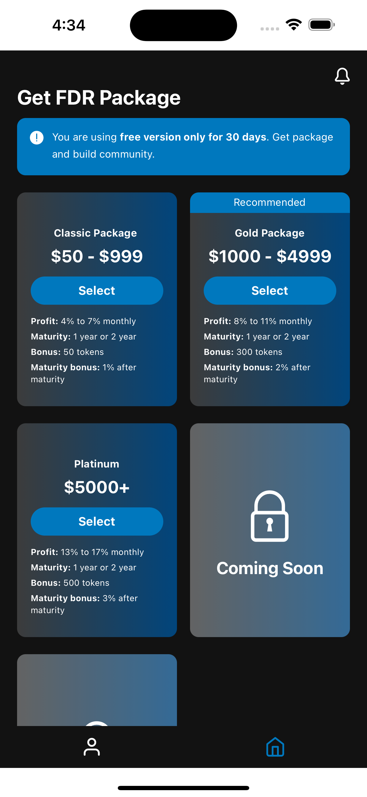
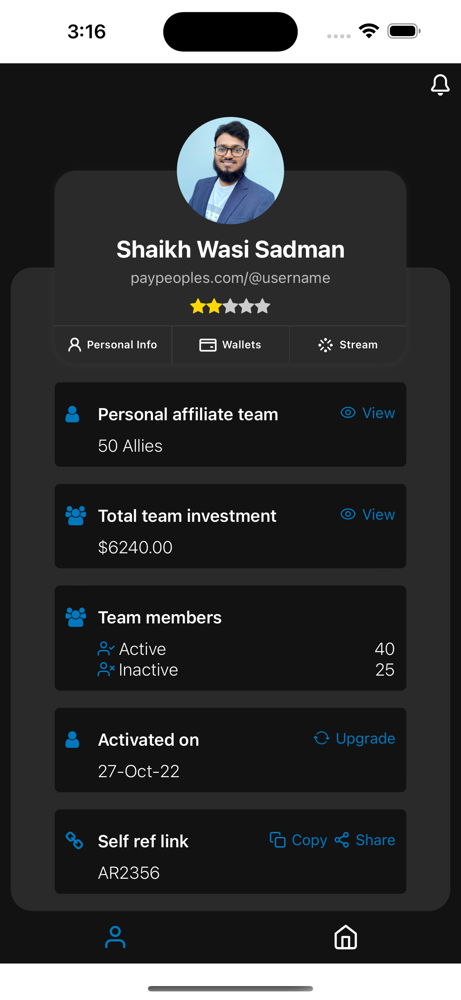

# FDRPackageApp
FDRPackageApp is a React Native demo application designed to showcase.

<p align="center">
  
  
</p>

## Features

- **Package Listing**: Display a list of available packages with relevant details.
- **Dynamic Pricing**: Format and display pricing information dynamically.
- **State Management**: Use MobX for efficient and reactive state management.
- **Data Fetching**: Leverage React Query for caching and synchronizing server state with the UI.

## Installation

1. **Clone the Repository**:
   ```bash
   git clone https://github.com/guitorioadar/FDRPackageApp.git
   ```

2. **Navigate to the Project Directory**:
   ```bash
   cd FDRPackageApp
   ```

3. **Install Dependencies**:
   ```bash
   yarn install
   ```

4. **Start the Application**:
   ```bash
   yarn start
   ```

## Usage

- **Home Screen**: View available fixed deposit packages and select options.
- **Profile Screen**: View user profile details and associated information.

## Technologies Used

- **React Native**: For building cross-platform mobile applications.
- **MobX and MobX-State-Tree**: For state management.
- **React Query**: For server state management and data fetching.
- **FlashList by Shopify**: For rendering list data.
- **Expo**: For streamlined development and deployment.

## Project Structure

- **`/Components`**: Reusable UI components.
- **`/Containers`**: Application screens such as Home and Profile.
- **`/Stores`**: MobX state management logic.
- **`/Services`**: API service and data fetching logic.
- **`/Navigators`**: Application navigation setup.

## License

This project is licensed under the MIT License - see the [LICENSE](LICENSE) file for details.

## Contact

For questions or support, please contact [wasisadman.cse@gmail.com](mailto:wasisadman.cse@gmail.com).
